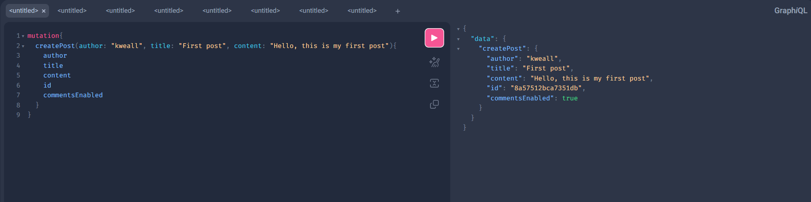
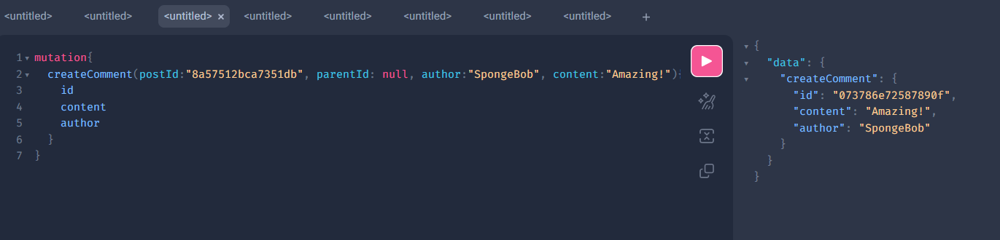
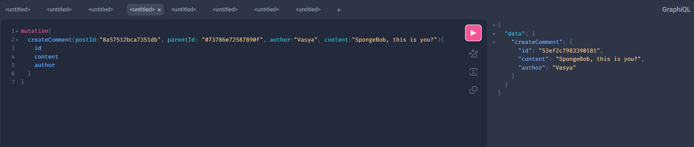
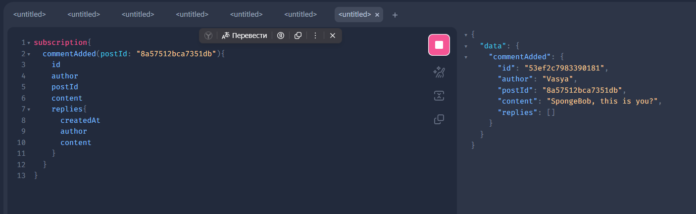
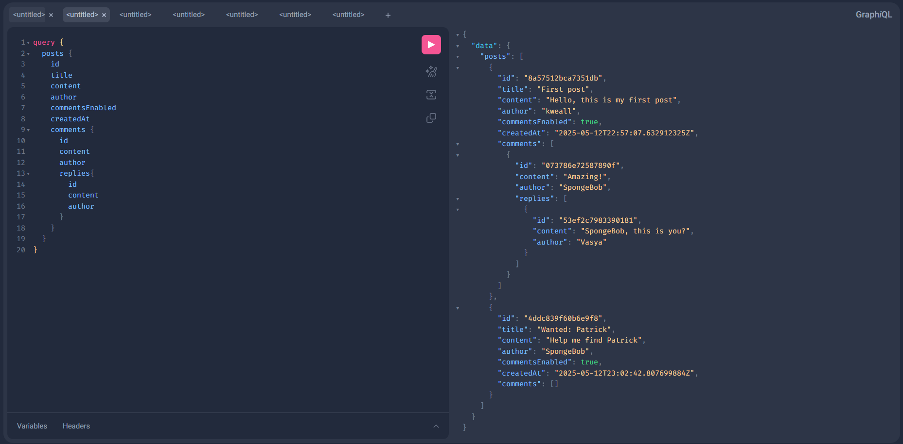
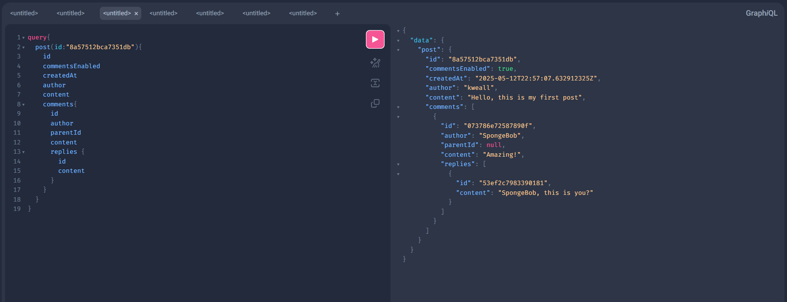
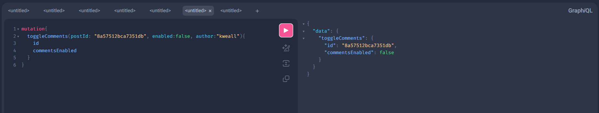

# **HiveMind - Посты и Комментарии с GraphQL**

Сервис с постами и комментариями, обеспечивающий возможность создания, управления и просмотра постов и комментариев. Система поддерживает иерархическую структуру комментариев с возможностью пагинации и асинхронного получения новых комментариев с помощью GraphQL Subscriptions. 

## **Функциональность**

### **Система постов**
- **Просмотр списка постов**: Получение всех постов с пагинацией.
- **Просмотр поста и комментариев**: Возможность просмотра конкретного поста и комментариев, связанных с ним.
- **Ограничение комментариев**: Автор поста может разрешить или запретить добавление комментариев к своему посту.

### **Система комментариев**
- **Иерархия комментариев**: Комментарии организованы иерархически, позволяя неограниченную вложенность.
- **Ограничение длины**: Максимальная длина комментария — 2000 символов.
- **Пагинация комментариев**: Пагинация для получения списка комментариев.
- **GraphQL Subscriptions**: Асинхронная доставка новых комментариев пользователям, подписанным на определенный пост.

## **Технологии**

- **Go** — основной язык разработки.
- **PostgreSQL** — реляционная база данных для хранения постов и комментариев.
- **Docker** — для контейнеризации и простоты деплоя.
- **GraphQL** — для взаимодействия с API.

## **Архитектура**

### **Структура хранения данных**

Система поддерживает два варианта хранения данных:
1. **In-memory storage**: Хранение данных в памяти, удобное для локальной разработки и тестирования.
2. **PostgreSQL storage**: Хранение данных в реляционной базе данных PostgreSQL для устойчивости и масштабируемости.

При старте сервиса выбирается тип хранилища через переменные окружения.

### **GraphQL Subscriptions**

Для эффективной работы с асинхронной доставкой новых комментариев используется GraphQL Subscriptions. Клиенты, подписавшиеся на определенный пост, получают новые комментарии без необходимости повторных запросов.

## **Установка и запуск**

Для локальной разработки и тестирования рекомендуется использовать Docker.

1. Клонируйте репозиторий:
    ```bash
    git clone https://github.com/your-repo/HiveMind.git
    cd HiveMind
    ```

2. Создайте контейнеры с помощью Docker Compose:
    ```bash
    docker-compose up --build
    ```

3. Откройте ваше приложение на [http://localhost:8080](http://localhost:8080).

### **Конфигурация**

Вам нужно настроить файл конфигурации для подключения к базе данных. Пример конфигурации для PostgreSQL:

```bash
STORAGE=postgres
DATABASE_URL=postgres://user:password@db:5432/hivemind?sslmode=disable
```

### Покрытие тестами составляет 83.2%

### Примеры использования:
#### Создание поста
```bash
mutation{
  createPost(author: "name", title: "example", content: "text"){
    author
    title
    content
    id
    commentsEnabled
  }
}
```

#### Создание комментария под постом
```bash
mutation{
  createComment(postId:"id", parentId: null, author:"name", content:"text"){
    id
    content
    author
  }
}
```

#### Создание комментария под комментарием
```bash
mutation{
  createComment(postId:"id", parentId: "parentId", author:"name", content:"text"){
    id
    content
    author
  }
}
```

#### Отслеживание новых комментариев под постом
```bash
subscription{
  commentAdded(postId: "id"){
    id
    author
    postId
    content
    replies{
      createdAt
      author
      content
    }
  }
}
```

#### Просмотр всех постов
```bash
query {
  posts {
    id
    title
    content
    author
    commentsEnabled
    createdAt
    comments {
      id
      content
      author
      replies{
        id
        content
        author
      }
    }
  }
}
```

#### Просмотр одного поста
```bash
query{
  post(id:"id"){
    id
    commentsEnabled
    createdAt
    author
    content
    comments{
      id
      author
      parentId
      content
      replies {
        id
        content
      }
    }
  }
}
```

#### Запрет на оставление комментариев к своему посту
```bash
mutation{
  toggleComments(postId: "id", enabled:false, author:"name"){
    id
    commentsEnabled
  }
}
```

